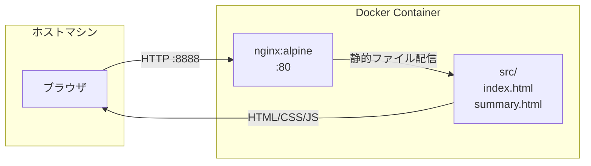
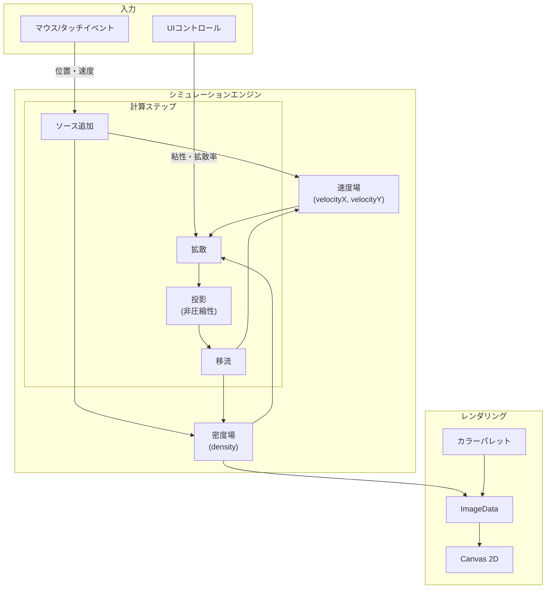
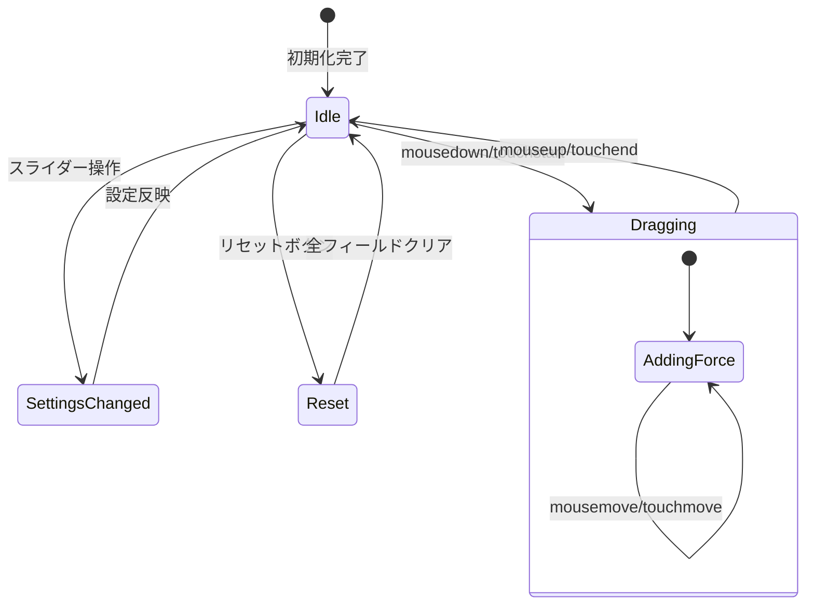

# アーキテクチャドキュメント

## ディレクトリ構成

```
fluid-simulation/
├── PROMPT.md              # 要求仕様
├── README.md              # プロジェクト概要
├── CONVERSATION.md        # 開発時の対話ログ
├── Dockerfile             # コンテナイメージ定義
├── docker-compose.yml     # コンテナ実行設定
├── nginx.conf             # nginx設定（CORS対応）
├── .gitignore             # Git除外設定
├── doc/
│   └── architecture.md    # 本ドキュメント
└── src/
    ├── index.html         # メインアプリケーション
    └── summary.html       # プロンプト要約ページ
```

## 使用ライブラリ一覧

| ライブラリ | バージョン | 用途 |
|-----------|-----------|------|
| なし | - | バニラJavaScriptで実装 |

## コンテナレベルのデータフロー



## モジュールレベルのデータフロー



## アルゴリズム詳細

### Jos Stam's Stable Fluid Solver

本実装はJos Stamの安定流体ソルバー（1999年発表）に基づいている。

```mermaid
sequenceDiagram
    participant Loop as メインループ
    participant Vel as 速度ステップ
    participant Den as 密度ステップ
    participant Render as 描画

    loop 毎フレーム
        Loop->>Vel: velocityStep()
        activate Vel
        Note over Vel: 1. addSource (外力追加)
        Note over Vel: 2. diffuse (拡散)
        Note over Vel: 3. project (非圧縮性)
        Note over Vel: 4. advect (移流)
        Note over Vel: 5. project (再投影)
        Vel-->>Loop: 速度場更新完了
        deactivate Vel

        Loop->>Den: densityStep()
        activate Den
        Note over Den: 1. addSource (色追加)
        Note over Den: 2. diffuse (拡散)
        Note over Den: 3. advect (移流)
        Den-->>Loop: 密度場更新完了
        deactivate Den

        Loop->>Render: render()
        Note over Render: 密度→色変換→Canvas描画
    end
```

### 主要関数

| 関数 | 役割 |
|------|------|
| `diffuse()` | Gauss-Seidel法による拡散計算 |
| `advect()` | Semi-Lagrangian法による移流計算 |
| `project()` | Helmholtz-Hodge分解で非圧縮性を保証 |
| `linearSolve()` | 反復法による線形方程式ソルバー |
| `setBounds()` | 境界条件の設定 |

## UI状態管理



## パフォーマンス考慮事項

- グリッドサイズは画面サイズから動的に計算（SCALE = 4px）
- Float32Array使用でメモリ効率を最適化
- requestAnimationFrameでVSync同期
- 反復回数は4回に制限（品質とパフォーマンスのバランス）
